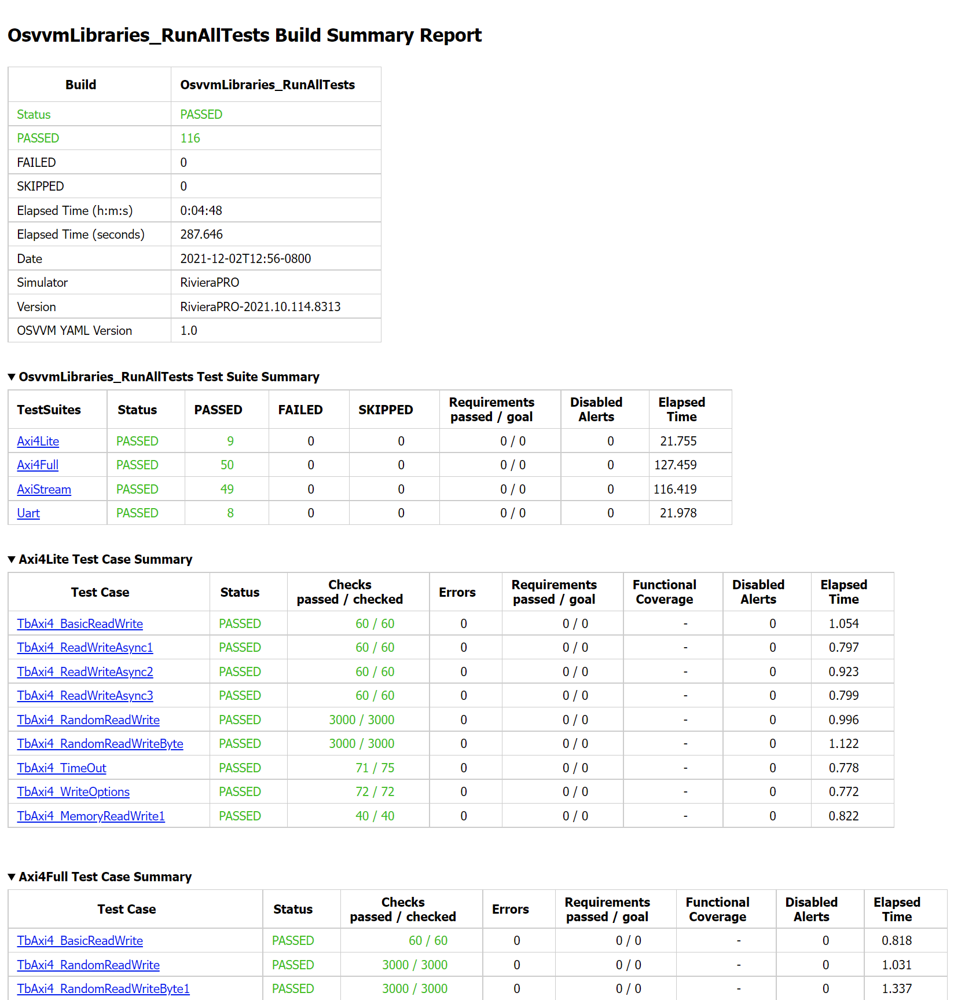
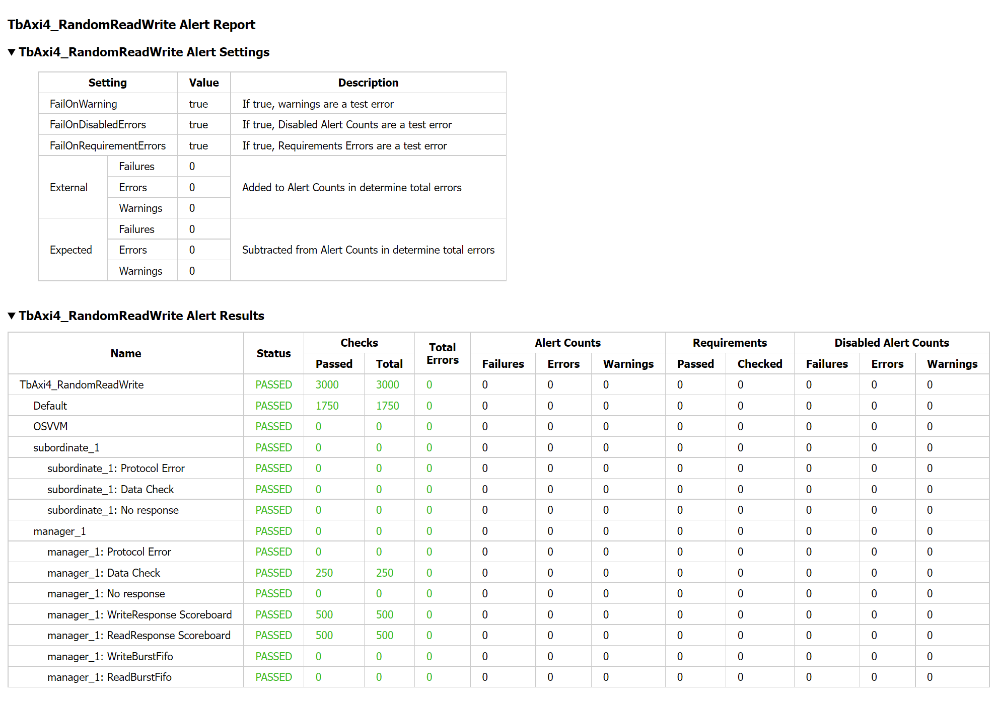

The OSVVM Simulator Script Library
##################################

The OSVVM Simulator Script Library provides a simple way to create and
activate libraries, compile designs, and run simulations.

The intent of this scripting approach is to:

-  Run the same scripts on any simulator
-  Be as easy to read as a compile order list.
-  Know the directory the script is in, the script only manages relative 
   paths to itself.  No Awkward path management in the scripts.
-  Simplify integration of other libraries

This is an evolving approach. So it may change in the future. Input is
welcome.

Start by Running the Demo
==================================

Download OSVVM Libraries 
-----------------------------------

OSVVM is available as either a git repository 
`OSVVM Libraries <https://github.com/osvvm/OsvvmLibraries>`__ 
or a zip file from `osvvm.org Downloads Page <https://osvvm.org/downloads>`__.

On GitHub, all OSVVM libraries are a submodule of the repository OsvvmLibraries. Download all OSVVM libraries using git clone with the “–recursive” flag:

.. code:: bash

   $ git clone --recursive https://github.com/osvvm/OsvvmLibraries

Create a Sim directory
----------------------

Create a simulation directory. Generally I name this "sim" or
"sim_vendor-name". Creating a simulation directory means that
cleanup before running regressions is just a matter of deleting the sim
directory and recreating a new one.

The following assumes you have created a directory named "sim" in the
OsvvmLibraries directory.

Alternately, you can run simulations out of the Scripts, but cleanup is
a mess as a simulator tends to create numerous temporaries.

Start the Script environment in the Simulator
--------------------------------------------------------

Do the actions appropriate for your simulator.

Aldec RivieraPRO, Siemens QuestaSim and ModelSim
~~~~~~~~~~~~~~~~~~~~~~~~~~~~~~~~~~~~~~~~~~~~~~~~

Initialize the OSVVM Script environment by doing:

.. code:: tcl

   source <path-to-OsvvmLibraries>/OsvvmLibraries/Scripts/StartUp.tcl

Want to avoid doing this every time? In Aldec RivieraPro, set the
environment variable, ALDEC_STARTUPTCL to StartUp.tcl (including the
path information). Similarly in Mentor QuestaSim/ModelSim, set the
environment variable, MODELSIM_TCL to StartUp.tcl (including the path
information).

Aldec ActiveHDL
~~~~~~~~~~~~~~~

Initialize the OSVVM Script environment by doing:

.. code:: tcl

   scripterconf -tcl
   do -tcl <path-to-OsvvmLibraries>/OsvvmLibraries/Scripts/StartUp.tcl

Want to avoid doing this every time? For ActiveHDL, edit
/script/startup.do and add above to it. Similarly for VSimSA, edit
/BIN/startup.do and add the above to it. Note, with 2021.02, you no
longer need to set the "Start In" directory to the OSVVM Scripts
directory.

GHDL in Windows
~~~~~~~~~~~~~~~~

Initialize the OSVVM Script environment by doing:

.. code:: tcl

   winpty tclsh
   source <path-to-OsvvmLibraries>/OsvvmLibraries/Scripts/StartUp.tcl
   
To simplify this, put ``source <path-to-OsvvmLibraries>/OsvvmLibraries/Scripts/StartUp.tcl`` 
in the ``.tclshrc`` file.
You can also add a windows short cut that includes 
``C:\tools\msys64\mingw64.exe winpty tclsh``. 

GHDL in Linux
~~~~~~~~~~~~~~~~

Initialize the OSVVM Script environment by doing:

.. code:: tcl

   rlwrap tclsh
   source <path-to-OsvvmLibraries>/OsvvmLibraries/Scripts/StartUp.tcl

To simplify this, put ``source <path-to-OsvvmLibraries>/OsvvmLibraries/Scripts/StartUp.tcl`` 
in the ``.tclshrc`` file.
In bash, add ``alias gsim='rlwrap tclsh'`` to your ``.bashrc``.

Synopsys VCS
~~~~~~~~~~~~

Initialize the OSVVM Script environment by doing:

.. code:: tcl

   rlwrap tclsh
   source <path-to-OsvvmLibraries>/OsvvmLibraries/Scripts/StartVCS.tcl

To simplify this, put ``source <path-to-OsvvmLibraries>/OsvvmLibraries/Scripts/StartVCS.tcl`` 
in the ``.tclshrc`` file.
In bash, add ``alias ssim='rlwrap tclsh'`` to your ``.bashrc``.

Cadence Xcelium
~~~~~~~~~~~~~~~

Initialize the OSVVM Script environment by doing:

.. code:: tcl

   rlwrap tclsh
   source <path-to-OsvvmLibraries>/OsvvmLibraries/Scripts/StartXcelium.tcl

To simplify this, put ``source <path-to-OsvvmLibraries>/OsvvmLibraries/Scripts/StartXcelium.tcl`` 
in the ``.tclshrc`` file.
In bash, add ``alias ssim='rlwrap tclsh'`` to your ``.bashrc``.

Xilinx XSIM
~~~~~~~~~~~

Using OSVVM in Xilinx XSIM is under development.  So far, Xilinx seems 
to be able to compile OSVVM utility library, however, we have not had
any of our internal test cases pass.  

To run OSVVM scripts in XSIM, start Vivado and then run the StartXSIM
script shown below:

.. code:: tcl

   source <path-to-OsvvmLibraries>/OsvvmLibraries/Scripts/StartXSIM.tcl

If someone from XILINX is interested, the internal OSVVM utility library
testbenches can be provided under an NDA.

Run the Demos
--------------

Do the following in your simulator command line:  

.. code-block::

  build  ../OsvvmLibraries
  build  ../OsvvmLibraries/RunDemoTests.pro
  
These will produce some reports, such as OsvvmLibraries_RunDemoTests.html.
We will discuss these in the next section, OSVVM Reports.

Writing Scripts by Example
==================================

OSVVM Scripts are an API layer that is build on top of TCL.
The API layer simplifies the steps of running simulations.
For most applications you will not need any TCL, however,
it is there if you need more capability.

Basic Commands
--------------------------

.. list-table:: 
    :widths: 25 40 
    :header-rows: 1
    
    * - Command
      - Description
    * - library <library-name>
      - Make this library the active library. Create it if it does not exist. 
    * - analyze <VHDL-file>.vhdl
      - Compile (aka analyze) the design into the active library.
    * - simulate <test-name>
      - Simulate (aka elaborate + run) the design using the active library.
    * - RunTest <test-name>.vhdl
      - Compile and simulate in one step when <VHDL-file> = <test-name>
    * - include <script-name>.pro
      - Include another project script
    * - build <script-name>.pro
      - Start a script from the simulator.  It is include + start a new log file for this script.
    * - TestSuite <test-suite-name>
      - Identify the current TestSuite.  If not specified the name is `default`.
    * - TestCase <test-name>
      - Identify the TestCase that is active. Must match name in the testbench call to SetAlertLogName.

Running a Simple Test
--------------------------
At the heart of running a simulation is setting the library, 
compiling files, and starting the simulation. 
To do this, we use library, analyze, and simulate. 

The following is an excerpt from the scripts used to 
run OSVVM verification component library regressions.

.. code:: tcl

   library  osvvm_TbAxi4_MultipleMemory
   analyze  TestCtrl_e.vhd
   analyze  TbAxi4_MultipleMemory.vhd
   analyze  TbAxi4_Shared1.vhd
   TestCase TbAxi4_Shared1
   simulate TbAxi4_Shared1

In OSVVM scripting, calling library activates the library. 
An analyze or simulate that follows library uses the specified library. 
This is consistent with VHDL’s sense of the "working library".

The above script is in the file, testbench_MultipleMemory.pro.
It can be run by specifying:

.. code:: tcl

   build ../OsvvmLibraries/AXI4/Axi4/testbench_MultipleMemory/testbench_MultipleMemory.pro

If you were to open testbench_MultipleMemory.pro, you would find
that `RunTest` is used instead as it is an abbreviation for the
analyze, TestCase and simulate when the names are the same.

Adding Scripts to Simulate
--------------------------
Often with simulations, we want to add a custom waveform file. 
This may be for all designs or just one particular design.
We may also need specific actions to be done when running
on a particular simulator.

As a result, when simulate runs, it will also include the
following files in order, if they exist:

-  OsvvmLibraries/Scripts/<ToolVendor>.tcl
-  OsvvmLibraries/Scripts/\<simulator\>.tcl
-  "sim-run-dir"/'<ToolVendor>'.tcl
-  "sim-run-dir"/"simulator".tcl
-  "sim-run-dir"/"LibraryUnit".tcl
-  "sim-run-dir"/"LibraryUnit"_"simulator".tcl
-  "sim-run-dir"/wave.do

ToolVendor is either {Aldec, Siemens, Cadence, Synopsys}. 
Simulator is one of {QuestaSim, ModelSim, RivieraPRO, ActiveHDL, VCS, Xcelium}. 
LibraryUnit is the name of the design being simulated. 
"Sim run dir" is the directory from which you run the simulator.

Currently GHDL does not run any extra scripts since it is a batch
simulator.

Including Scripts
~~~~~~~~~~~~~~~~~
We build our designs hierarchically.
Therefore our scripts need to be build hierarchically.

In TCL, source (or with EDA tools do) is used to run lower level scripts. 
For an EDA tool, there are two directories of interest, 
the directory the tool is running in and the script directory. 
EDA tool settings are directory dependent, 
so the script cannot change directories. 
This forces the script to manage the location 
of the files referenced in the script and 
makes scripting awkward.

To address this situation, OSVVM adds include. 
Include manages both the run directory and the script directory. 
All calls to the OSVVM script API that reference a file, 
reference the file relative to the current script directory – 
rather than the run directory. 
Hence, a script only needs to reference files relative to 
its location, making path references simple. 
It also simplifies making directory structure changes to a project.

The script, OsvvmLibraries.pro shown below, 
is the starting point for compiling all of OSVVM. 
It simply calls the scripts from the OSVVM Utility library, 
Verification Component Common library, 
UART verification component library, and 
AXI4 verification component libraries using include.

.. code:: tcl

   include ./osvvm/osvvm.pro
   include ./Common/Common.pro
   include ./UART/UART.pro
   include ./AXI4/AXI4.pro

Building the OSVVM Libraries
~~~~~~~~~~~~~~~~~~~~~~~~~~~~
Build is a layer on top of include (it calls include) that creates a logging point. 
By default, OSVVM creates collects all tool output for a build into 
an html based log file in ./logs/<tool_name>-<version>/<build>.html.

In addition, when a test is started with build, run with simulate,
and includes a call to "EndOfTestReports" at the end of the VHDL testbench,
a build report with the formats YAML, HTML, and JUnit XML reporting. 
In addition, a detailed test report (in YAML and HTML) will be created that 
lists out all AlertLogIDs and their state (PASSED, FAILED, Errors, ...)
as well as reports of coverage models (if the test has any).

In general, build is called from the simulator API (when we run something) 
and include is called from scripts.

To compile all of the OSVVM libraries, use build as shown below. 

.. code:: tcl

   build <path_to_OsvvmLibraries>/OsvvmLibraries.pro

Running OSVVM Libraries
~~~~~~~~~~~~~~~~~~~~~~~
To run the full OSVVM verification component regression suite use the build shown below.

.. code:: tcl

   build <path_to_OsvvmLibraries>/RunAllTests.pro

Everything in OSVVM is composed hierarchically. 
So if you want to run a regression on a particular verification
component, you simply run its build.  These are shown below.

.. code:: tcl

   build ../AXI4/Axi4/RunAllTests.pro
   build ../AXI4/Axi4Lite/RunAllTests.pro
   build ../AXI4/AxiStream/RunAllTests.pro
   build ../UART/RunAllTests.pro
   
Build Summary Report
~~~~~~~~~~~~~~~~~~~~~~~
The build summary report is a summary of all tests run 
during that build in YAML, HTML, and JUnit XML.
This report allows us to confirm that all tests finished successfully.

The best way to see the reports is run one of the OSVVM regressions.   
Run build OsvvmLibraries/RunAllTests.pro, then open the file 
OsvvmLibraries_RunAllTests.html.   

The following is an excerpt of OsvvmLibraries_RunAllTests.html.  
Failures are shown in red (none here).  Passing tests are shown in green.

 

Detailed Test Report
~~~~~~~~~~~~~~~~~~~~~~~
The detailed test report is a detailed report of 
alerts and coverage models.   
The best way to see the reports is run one of the OSVVM 
regression suites.   
After running one of the regressions, open one of the HTML files 
in the directory ./reports (default directory).   

The first half of the report is a summary of the alerts encountered
for each AlertLogID during the test.   
This is shown in the following figure.

The second half of the report is the coverage report for each coverage 
model defined in the test environment. 
Note that items with a triangle in front of them can be closed for
more compact viewing.
The coverage report below is for test TbCov_CovDb_2 in the OSVVM 
utility library regression suite.   Note that coverage model 
"Test 3" is closed for more compact viewing.

.. image:: images/CoverageReport.png

VHDL Aspects of Generating Reports
~~~~~~~~~~~~~~~~~~~~~~~~~~~~~~~~~~
To generate reports, you need to have the following OSVVM test code in your VHDL testbench.
More details of this are in OSVVM Test Writers User Guide in the documentation repository.

.. code:: vhdl

   -- Reference to OSVVM Utility Library
   library OSVVM ;
   context OSVVM.OsvvmContext ;
   . . . 
   TestProc : process
   begin
     -- Name the Test
     SetAlertLogName("TestName") ; 
     . . .
     -- Do some Checks
     AffirmIfEqual(Data, X"A025", "Check Data") ;
     . . . 
     -- Generate Reports (replaces call to ReportAlerts)
     EndOfTestReports ; 
     std.env.stop(GetAlertCount) ; 
   end process TestProc ; 

Generating Reports and Simple Tests
~~~~~~~~~~~~~~~~~~~~~~~~~~~~~~~~~~~~~
If we have a simple test, where the design name is 
Dut.vhd and the testbench is TbDut.vhd,
then we can run it with the following script

.. code:: tcl

   # File name:  Dut.pro
   analyze   Dut.vhd
   analyze   TbDut.vhd
   simulate  TbDut
   
If we run this test with using ``build Dut.pro``, 
Dut and TbDut will be compiled into the library named default. 
The simulation TbDut will run and 
a build summary report will be created with only one test case in it.
The test suite will be named Default. 
The test case will be named TbDut.  
Be sure to name the test internally to TbDut using SetAlertLogName
as otherwise, a NAME_MISMATCH failure will be generated.

Generating Reports and Running Tests without Configurations
~~~~~~~~~~~~~~~~~~~~~~~~~~~~~~~~~~~~~~~~~~~~~~~~~~~~~~~~~~~~~~~~~
In OSVVM, we use the testbench framework shown in the
OSVVM Test Writers User Guide (see documentation repository). 
The test harness in this example is named TbUart. 
The test sequencer entity is in file TestCtrl_e.vhd. 
Tests are in architectures of TestCtrl in the files,
TestCtrl_SendGet1.vhd, TestCtrl_SendGet2.vhd, and TbtCtrl_Scoreboard1.vhd. 
The tests are run by calling "simulate TbUart".
TestCase is used to specify the test name that is running.
This is needed here as otherwise the name TbUart would be used.
The test case that is run is the latest one that was analyzed.

.. code:: tcl

   TestSuite Uart
   library   osvvm_TbUart
   analyze   TestCtrl_e.vhd
   analyze   TbUart.vhd

   TestCase  TbUart_SendGet1
   analyze   TestCtrl_SendGet1.vhd 
   simulate  TbUart

   TestCase  TbUart_SendGet2
   analyze   TestCtrl_SendGet2.vhd 
   simulate  TbUart

   TestCase  TbUart_Scoreboard1
   analyze   TestCtrl_Scoreboard1.vhd 
   simulate  TbUart
   
The above call to TestCase puts the TestCase name into the build
test summary YAML file.   
If the simulation for any reason fails to run, there will be 
no test status information in the YAML file.
As a result, when the build summary report is being created,
it will detect this as a test failure.

Another possibility in the above test scenario is that a 
particular test case fails to analyze.   
In this case, if the script continues and calls simulate,
the previously successfully compiled test will run.
In this case, if each test is given a unique name in VHDL
using SetAlertLogName (which is also recorded in the YAML file),
then the VHDL test name will not match the test case name
and a NAME_MISMATCH failure will be generated by the scripts.  

Generating Reports and Running Tests with Configurations
~~~~~~~~~~~~~~~~~~~~~~~~~~~~~~~~~~~~~~~~~~~~~~~~~~~~~~~~~~~~~~~~~~~~
The OSVVM verification component regression suite uses configurations 
to specify an exact architecture to run in a given test.
We give the configuration, the test case, and the file the same name.
We also put the configuration declartion at the end of the file
containing the test case (try it, you will understand why).  
When we run a test that uses a configuration, simulate specifies 
the configuration's design unit name.
Hence, we revise the sequence of running one test to be as follows.

.. code:: tcl

   TestCase  TbUart_SendGet1
   analyze   TbUart_SendGet1.vhd 
   simulate  TbUart_SendGet1

When running a large test suite, this gets tedious, so we added 
a shortcut named RunTest that encapsulates the above three
steps into the single step.  
This changes our original script to the following. 
If the name in RunTest has a path, the path is only used with analyze.

.. code:: tcl

   TestSuite Uart
   library   osvvm_TbUart
   analyze   TestCtrl_e.vhd
   analyze   TbUart.vhd

   RunTest   TbUart_SendGet1.vhd 
   RunTest   TbUart_SendGet2.vhd 
   RunTest   TbUart_Scoreboard1.vhd 

One advantage of using configurations is that 
on a clean build (library deleted before starting it), 
if a test case fails to analyze, then the 
corresponding configuration will fail to analyze, 
and the simulation will fail to run.
If this happens, it will be detected and recorded
as a test failure in the build summary report.

Turning on Code Coverage 
~~~~~~~~~~~~~~~~~~~~~~~~~~~~~~~~~~~~~~~~~~~~~~~~~~~~~~~~~~~~~~~~~~~~
Code coverage is a metric that tells us if certain parts of our design
have been exercised or not.  Turning on code coverage with OSVVM is simple.
In the following example, we enable coverage options during analysis and 
simulation separately.   

.. code:: tcl

   # File name:  Dut.pro
   SetCoverageAnalyzeEnable true
   analyze   Dut.vhd
   SetCoverageAnalyzeEnable false
   SetCoverageSimulateEnable true
   analyze   TbDut.vhd
   simulate  TbDut
   SetCoverageSimulateEnable false
   
Note that CoverageAnalyzeEnable is specifically turned off
before compiling the testbench so that the testbench is not 
included in the coverage metrics.

You can also set specific options by using SetCoverageAnalyzeOptions 
and SetCoverageSimulateOptions.  By default, OSVVM sets these options
so that statement, branch, and statemachine coverage is collected. 

When coverage is turned on for a build, coverage is collected for each test.  
If there are multiple test suites in the build, then 
the coverage for each test in the test suite is merged.  
When a build completes the coverage from each test suite 
is merged and an html coverage report is produced.

Command Summary 
----------------
Commands are case sensitive.  Single word names are
all lower case.  Multiple word names are CamelCase.

library <library> [<path>] 
~~~~~~~~~~~~~~~~~~~~~~~~~~~
Make the library the active library. If the 
library does not exist, create it and create a 
mapping to it. Libraries are created in the 
path specified by LIB_BASE_DIR in Scripts/StartUp.tcl. 

LinkLibrary <library> [<path>]  
~~~~~~~~~~~~~~~~~~~~~~~~~~~~~~~~~
Create a mapping to a library that was already created.

LinkLibraryDirectory [LibraryDirectory]  
~~~~~~~~~~~~~~~~~~~~~~~~~~~~~~~~~~~~~~~~~~~~~
Map all of the libraries in the specified library directory.
If one is not specified, one is looked for in the current 
directory.

SetLibraryDirectory [LibraryDirectory]  
~~~~~~~~~~~~~~~~~~~~~~~~~~~~~~~~~~~~~~~~~~~~~
Set the directory in which the libraries will be created.
The libraries will be created in this directory in a 
directory named, "VHDL_LIBS/<tool version>/".

GetLibraryDirectory  
~~~~~~~~~~~~~~~~~~~~~~~~~~~
Get the Library Directory.

analyze <file>
~~~~~~~~~~~~~~~~~~~~~~~~~~~
Compile the file. A path name specified is
relative to the location of the current <file>.pro
directory location. Library is the one 
specified in the previous library command.

simulate <design-unit>
~~~~~~~~~~~~~~~~~~~~~~~~~~~
Start a simulation on the design unit. 
Library is the one specified in the 
previous library command.   

RunTest <file> [<name>]
~~~~~~~~~~~~~~~~~~~~~~~~~~~
RunTest combines TestCase, analyze, and simulate. 
RunTest optionally takes two parameters. 
With two parameters, the first is the file 
name to analyze, the second is the design 
unit name to use for simulation and TestCase. 
With one parameter, the first parameter is 
the file name.  The second parameter is 
the base name of the file name - any path 
and file extension are removed. 

include [<path>/]<name>
~~~~~~~~~~~~~~~~~~~~~~~~~~~
Include accepts an argument "name" that 
is either a file or a directory. If it  
is a file and its extension is .pro, .tcl, 
or .do, it will be sourced. 

If "name" is a directory, then files 
whose name is "name" and whose extension is 
.pro, .tcl, or .do, it will be sourced. 

All paths and names specifed are relative are 
relative to the current directory from 
which the script is running. 

Extensions of the form ".files" or 
".dirs is handled in a manner described 
in "Deprecated Descriptor Files". 

build [<path>/]<name>
~~~~~~~~~~~~~~~~~~~~~~~~~~~
Re-initializes the working directory to 
the script directory, opens a transcript 
file, and calls include. A path name 
specified is relative to the location of 
the current <file>.pro directory location.

SetVHDLVersion
~~~~~~~~~~~~~~~~~~~~~~~~~~~
Set VHDL analyze version. 
Valid values = (2008, 2019, 1993, 2002). 
OSVVM libraries require 2008 or newer.

GetVHDLVersion
~~~~~~~~~~~~~~~~~~~~~~~~~~~
Return the current VHDL Version.

SetSimulatorResolution
~~~~~~~~~~~~~~~~~~~~~~~~~~~
Set Simulator Resolution. 
Any value supported by the simulator is ok.

GetSimulatorResolution
~~~~~~~~~~~~~~~~~~~~~~~~~~~
Return the current Simulator Resolution.

TestCase <name>
~~~~~~~~~~~~~~~~~~~~~~~~~~~
Set the test case name.

SkipTest <string>
~~~~~~~~~~~~~~~~~~~~~~~~~~~
Adds a place holder in the results file for a test case 
that does not run in a particular tool. 
The <string> value specifies the reason the test case 
was skipped in this tool.

TestSuite <name> 
~~~~~~~~~~~~~~~~~~~~~~~~~~~
Set the test suite name. 

SetTranscriptType 
~~~~~~~~~~~~~~~~~~~~~~~~~~~
Select the Transcript file to be either html or log.
The default is html.

GetTranscriptType
~~~~~~~~~~~~~~~~~~~~~~~~~~~
Get the Transcript file type (either html or log).

SetCoverageAnalyzeEnable ""
~~~~~~~~~~~~~~~~~~~~~~~~~~~~~~
Value true selects use coverage options during analyze.
Value "" sets the enable to the specified by SetCoverageEnable.

GetCoverageAnalyzeEnable
~~~~~~~~~~~~~~~~~~~~~~~~~~~
Returns the current enable setting.

SetCoverageAnalyzeOptions "value"
~~~~~~~~~~~~~~~~~~~~~~~~~~~~~~~~~~
Set the coverage options.

GetCoverageAnalyzeOptions 
~~~~~~~~~~~~~~~~~~~~~~~~~~~~~~~~~~
Set the coverage options for analyze to the string value.

SetCoverageSimulateEnable ""
~~~~~~~~~~~~~~~~~~~~~~~~~~~~~~
Value true selects use coverage options during simulation.
Value "" sets the enable to the specified by SetCoverageEnable.

GetCoverageSimulateEnable
~~~~~~~~~~~~~~~~~~~~~~~~~~~
Returns the current enable setting.

SetCoverageSimulateOptions "value"
~~~~~~~~~~~~~~~~~~~~~~~~~~~~~~~~~~
Set the coverage options for simulate to the string value.

GetCoverageSimulateOptions
~~~~~~~~~~~~~~~~~~~~~~~~~~~~~~~~~~
Get the coverage options to the string value.

SetCoverageEnable "value"
~~~~~~~~~~~~~~~~~~~~~~~~~~~
Set CoverageEnable to value. 
If no value is specified, then the value is "true".  
The default value is "true"

GetCoverageEnable
~~~~~~~~~~~~~~~~~~~~~~~~~~~
Get the CoverageEnable value. 

SetVhdlAnalyzeOptions "value"
~~~~~~~~~~~~~~~~~~~~~~~~~~~~~~~~~~
Set the VHDL options for analyze to the string value.

GetVhdlAnalyzeOptions 
~~~~~~~~~~~~~~~~~~~~~~~~~~~~~~~~~~
Get the VHDL options for analyze.

SetVerilogAnalyzeOptions "value"
~~~~~~~~~~~~~~~~~~~~~~~~~~~~~~~~~~
Set the Verilog options for analyze to the string value.

GetVerilogAnalyzeOptions 
~~~~~~~~~~~~~~~~~~~~~~~~~~~~~~~~~~
Get the Verilog options for analyze.

SetExtendedAnalyzeOptions "value" 
~~~~~~~~~~~~~~~~~~~~~~~~~~~~~~~~~~
Set extended (additional) options for analyze to the string value.

GetExtendedAnalyzeOptions
~~~~~~~~~~~~~~~~~~~~~~~~~~~~~~~~~~
Get extended (additional) options for analyze.

SetExtendedSimulateOptions "value"
~~~~~~~~~~~~~~~~~~~~~~~~~~~~~~~~~~
Set extended (additional) options for simulate to the string value.

GetExtendedSimulateOptions
~~~~~~~~~~~~~~~~~~~~~~~~~~~~~~~~~~
Get extended (additional) options for simulate.

LinkCurrentLibraries 
~~~~~~~~~~~~~~~~~~~~~~~~~~~
EDA tools are centric to the current directory
If you change directory, the EDA tool will loose 
all of its library mapping information. 
If immediately after a change directory, a LinkCurrentLibraries
is called, then all existing libraries will be mapped in 
the current directory.

RemoveAllLibraries
~~~~~~~~~~~~~~~~~~~~~~~~~~~
Delete all of the working libraries.

Undocumented Items
~~~~~~~~~~~~~~~~~~~~~~~~~~~
Anything undocumented is experimental and may change or be removed in a future revision.

The Script Files
----------------

-  StartUp.tcl

   -  StartUp script for ActiveHDL, GHDL, Mentor, RivieraPro, and VSimSA (ActiveHDL)
   -  Detects the simulator running and calls the VendorScript_vendor-name.tcl.
      Also calls OsvvmProjectScripts.tcl and OsvvmScriptDefaults.tcl

-  StartVCS.tcl

   -  StartUp script for Synopsys VCS.  Does what StartUp.tcl does except is specific to VCS
      
-  StartXcelium.tcl

   -  StartUp script for Cadence Xcelium.  Does what StartUp.tcl does except is specific to Xcelium
      
-  StartXSIM.tcl

   -  StartUp script for Xilinx XSIM.  Does what StartUp.tcl does except is specific to Xsim
   -  Note, XSIM is currently a alpha level, experimental release.
      
-  VendorScript_tool-name.tcl

   -  TCL procedures that do simulator specific actions.
   -  "tool-name" = one of (ActiveHDL, GHDL, Mentor, RivieraPro, VSimSA, VCS, Xcelium, Xsim)
   -  VSimSA is the one associated with ActiveHDL.
   -  Called by StartUp.tcl 

-  OsvvmProjectScripts.tcl

   -  TCL procedures that do common simulator and project build tasks.
   -  Called by StartUp.tcl

-  OsvvmScriptDefaults.tcl

   -  Default settings for the OSVVM Script environment.
   -  Called by StartUp.tcl
   
-  LocalScriptDefaults.tcl

   -  User default settings for the OSVVM Script environment.
   -  Not in OSVVM repository so it will not be replaced on OSVVM updates
   -  If it exists, called by StartUp.tcl

Deprecated Descriptor Files
---------------------------

Include with a file extension of ".dirs" or ".files" is deprecated and
is only supported for backward compatibility.

<Name>.dirs is a directory descriptor file that contains a list of
directories. Each directory is handled by calling "include <directory>".

<Name>.files is a file descriptor that contains a list of names. Each
name is handled by calling "analyze <name>". If the extension of the
name is ".vhd" or ".vhdl" the file will be compiled as VHDL source. If
the extension of the name is ".v" the file will be compiled as verilog
source. If the extension of the name is ".lib", it is handled by calling
"library <name>".

Release History
---------------

For the release history see, `CHANGELOG.md <CHANGELOG.md>`__

Participating and Project Organization
--------------------------------------

The OSVVM project welcomes your participation with either issue reports
or pull requests. For details on `how to participate
see <https://opensource.ieee.org/osvvm/OsvvmLibraries/-/blob/master/CONTRIBUTING.md>`__

You can find the project `Authors here <AUTHORS.md>`__ and `Contributors
here <CONTRIBUTORS.md>`__.

More Information on OSVVM
-------------------------

**OSVVM Forums and Blog:** http://www.osvvm.org/   

**SynthWorks OSVVM Blog:** http://www.synthworks.com/blog/osvvm/   

**Gitter:** https://gitter.im/OSVVM/Lobby   

**Documentation:** `Documentation for the OSVVM libraries can be found
here <https://github.com/OSVVM/Documentation>`__

Copyright and License
---------------------

Copyright (C) 2006-2021 by `SynthWorks Design Inc. <http://www.synthworks.com/>`__ 

Copyright (C) 2021 by `OSVVM contributors <CONTRIBUTOR.md>`__

This file is part of OSVVM.

::

   Licensed under Apache License, Version 2.0 (the "License")
   You may not use this file except in compliance with the License.
   You may obtain a copy of the License at

http://www.apache.org/licenses/LICENSE-2.0

::

   Unless required by applicable law or agreed to in writing, software
   distributed under the License is distributed on an "AS IS" BASIS,
   WITHOUT WARRANTIES OR CONDITIONS OF ANY KIND, either express or implied.
   See the License for the specific language governing permissions and
   limitations under the License.
