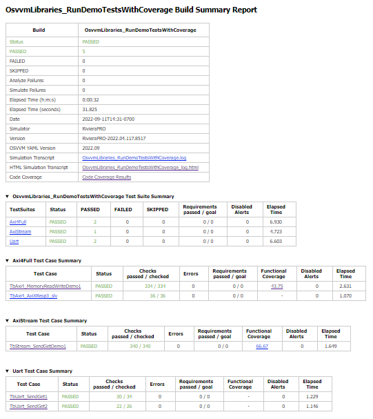
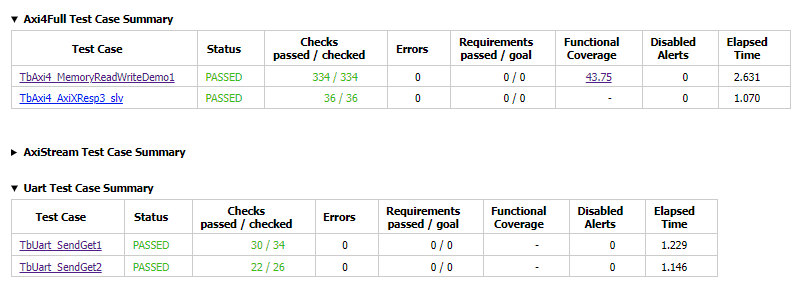
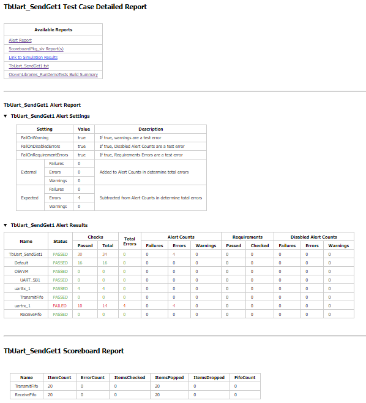

The OSVVM Simulator Script Library
##################################

The OSVVM Simulator Script Library provides a provides a simple way to 
compile designs, run simulations, and use libraries.

This scripting approach provides:

-  Scripts as simple as a list of files
-  Scripts that run on any simulator
-  Simple path management – everything is relative to the script location
-  Simple usage of libraries

This is an evolving approach. Input is welcome.

Start by Running the Demo
==================================

Download OSVVM Libraries 
-----------------------------------

OSVVM is available as either a git repository 
`OSVVM Libraries <https://github.com/osvvm/OsvvmLibraries>`__ 
or a zip file from `osvvm.org Downloads Page <https://osvvm.org/downloads>`__.

On GitHub, all OSVVM libraries are a submodule of the repository OsvvmLibraries. Download all OSVVM libraries using git clone with the “–recursive” flag:

.. code:: bash

   $ git clone --recursive https://github.com/osvvm/OsvvmLibraries

Create a Sim directory
----------------------

Create a simulation directory. Generally I name this "sim" or
"sim_vendor-name". Creating a simulation directory means that
cleanup before running regressions is just a matter of deleting the sim
directory and recreating a new one.

The following assumes you have created a directory named "sim" in the
OsvvmLibraries directory.

Alternately, you can run simulations out of the Scripts, but cleanup is
a mess as a simulator tends to create numerous temporaries.

Start the Script environment in the Simulator
--------------------------------------------------------

Do the actions appropriate for your simulator.

Aldec RivieraPRO, Siemens Visualizer, Questa, and ModelSim
~~~~~~~~~~~~~~~~~~~~~~~~~~~~~~~~~~~~~~~~~~~~~~~~

Initialize the OSVVM Script environment by doing:

.. code:: tcl

   source <path-to-OsvvmLibraries>/OsvvmLibraries/Scripts/StartUp.tcl

Want to avoid doing this every time? In Aldec RivieraPro, set the
environment variable ALDEC_STARTUPTCL to StartUp.tcl (including the
path information). In Siemens Visualizer, set the environment variable 
VISUALIZER_TCL to StartUp.tcl (including the path information).  
In Siemens Questa/ModelSim, set the environment variable MODELSIM_TCL 
to StartUp.tcl (including the path information).

Aldec ActiveHDL
~~~~~~~~~~~~~~~

Initialize the OSVVM Script environment by doing:

.. code:: tcl

   scripterconf -tcl
   do -tcl <path-to-OsvvmLibraries>/OsvvmLibraries/Scripts/StartUp.tcl

Want to avoid doing this every time? For ActiveHDL, edit
/script/startup.do and add above to it. Similarly for VSimSA, edit
/BIN/startup.do and add the above to it. Note, with 2021.02, you no
longer need to set the "Start In" directory to the OSVVM Scripts
directory.

GHDL in Windows
~~~~~~~~~~~~~~~~

Initialize the OSVVM Script environment by doing:

.. code:: tcl

   winpty tclsh
   source <path-to-OsvvmLibraries>/OsvvmLibraries/Scripts/StartUp.tcl
   
To simplify this, put ``source <path-to-OsvvmLibraries>/OsvvmLibraries/Scripts/StartUp.tcl`` 
in the ``.tclshrc`` file and add a windows short cut that does 
``C:\tools\msys64\mingw64.exe winpty tclsh``. 

GHDL in Linux
~~~~~~~~~~~~~~~~

Initialize the OSVVM Script environment by doing:

.. code:: tcl

   rlwrap tclsh
   source <path-to-OsvvmLibraries>/OsvvmLibraries/Scripts/StartUp.tcl

To simplify this, put ``source <path-to-OsvvmLibraries>/OsvvmLibraries/Scripts/StartUp.tcl`` 
in the ``.tclshrc`` file and in bash add ``alias gsim='rlwrap tclsh'`` to your ``.bashrc``.

NVC in Windows
~~~~~~~~~~~~~~~~

Initialize the OSVVM Script environment by doing:

.. code:: tcl

   winpty tclsh
   source <path-to-OsvvmLibraries>/OsvvmLibraries/Scripts/StartNVC.tcl
   
To simplify this, put ``source <path-to-OsvvmLibraries>/OsvvmLibraries/Scripts/StartNVC.tcl`` 
in the ``.tclshrc`` file and add a windows short cut that does 
``C:\tools\msys64\mingw64.exe winpty tclsh``.

NVC in Linux
~~~~~~~~~~~~~~~~

Initialize the OSVVM Script environment by doing:

.. code:: tcl

   rlwrap tclsh
   source <path-to-OsvvmLibraries>/OsvvmLibraries/Scripts/StartNVC.tcl

To simplify this, put ``source <path-to-OsvvmLibraries>/OsvvmLibraries/Scripts/StartNVC.tcl`` 
in the ``.tclshrc`` file and in bash add ``alias nsim='rlwrap tclsh'`` to your ``.bashrc``.

Synopsys VCS
~~~~~~~~~~~~

Initialize the OSVVM Script environment by doing:

.. code:: tcl

   rlwrap tclsh
   source <path-to-OsvvmLibraries>/OsvvmLibraries/Scripts/StartVCS.tcl

To simplify this, put ``source <path-to-OsvvmLibraries>/OsvvmLibraries/Scripts/StartVCS.tcl`` 
in the ``.tclshrc`` file.
In bash, add ``alias ssim='rlwrap tclsh'`` to your ``.bashrc``.

Cadence Xcelium
~~~~~~~~~~~~~~~

Initialize the OSVVM Script environment by doing:

.. code:: tcl

   rlwrap tclsh
   source <path-to-OsvvmLibraries>/OsvvmLibraries/Scripts/StartXcelium.tcl

To simplify this, add the following line to the ``.tclshrc`` file.

.. code:: tcl

   source <path-to-OsvvmLibraries>/OsvvmLibraries/Scripts/StartXcelium.tcl
 
In bash, add ``alias ssim='rlwrap tclsh'`` to your ``.bashrc``.

Xilinx XSIM
~~~~~~~~~~~

Using OSVVM in Xilinx XSIM is under development.  So far, Xilinx seems 
to be able to compile OSVVM utility library, however, we have not had
any of our internal test cases pass.  

To run OSVVM scripts in XSIM, start Vivado and then run the StartXSIM
script shown below:

.. code:: tcl

   source <path-to-OsvvmLibraries>/OsvvmLibraries/Scripts/StartXSIM.tcl

If someone from XILINX is interested, the internal OSVVM utility library
testbenches can be provided under an NDA.

Run the Demos
--------------

Do the following in your simulator command line:  

.. code-block::

  build  ../OsvvmLibraries
  build  ../OsvvmLibraries/RunDemoTests.pro
  
These will produce some reports, such as OsvvmLibraries_RunDemoTests.html.
We will discuss these in the next section, OSVVM Reports.

Writing Scripts by Example
==================================

OSVVM Scripts are an API layer that is build on top of TCL.
The API layer simplifies the steps of running simulations.
For most applications you will not need any TCL, however,
it is there if you need more capability.

Basic Script Commands
--------------------------
- library <library-name>
   - Make this library the active library. Create it if it does not exist. 
- analyze <VHDL-file>
   - Compile (aka analyze) the design into the active library.
- simulate <test-name>
   - Simulate (aka elaborate + run) the design using the active library.
- include <script-name>.pro
   - Include another project script
- build <script-name>.pro
   - Start a script from the simulator.  It is include + start a new log file for this script.
   
Scripts are named in the form ``<script-name>.pro``.  
The scripts are TCL that is agumented with the OSVVM script API.
The script API is created using TCL procedures.  

For more details, see Command Summary later in this document.

Running a Simple Test
--------------------------
At the heart of running a simulation is setting the library, 
compiling files, and starting the simulation. 
To do this, we use library, analyze, and simulate. 

The following is an excerpt from the scripts used to 
run OSVVM verification component library regressions.

.. code:: tcl

   library  osvvm_TbAxi4_MultipleMemory
   analyze  TestCtrl_e.vhd
   analyze  TbAxi4_MultipleMemory.vhd
   analyze  TbAxi4_Shared1.vhd
   TestName TbAxi4_Shared1
   simulate TbAxi4_Shared1

In OSVVM scripting, calling library activates the library. 
An analyze or simulate that follows library uses the specified library. 
This is consistent with VHDL’s sense of the "working library".

Note that there are no paths to the files.
For OSVVM commands that use paths, the path is
always relative to the directory the script is located in
unless an absolute path is specified.

The above script is in the file, testbench_MultipleMemory.pro.
It can be run by specifying:

.. code:: tcl

   build ../OsvvmLibraries/AXI4/Axi4/testbench_MultipleMemory/testbench_MultipleMemory.pro

If you were to open testbench_MultipleMemory.pro, you would find
that RunTest is used instead as it is an abbreviation for the
analyze, TestName and simulate when the names are the same.

Simulating with Generics
--------------------------
To specify generics, use the OSVVM generic function. 
Generic is called in the call to simulate as shown below.
Note the square brackets are required and tell TCL to call 
the function to create the arguments for simulate.  
Calling generic this way allows OSVVM to do set generics using
the method required by each simulator.  

.. code:: tcl

   library  default
   simulate Tb [generic WIDTH 8]
   simulate Tb [generic G1 5] [generic G2 7]
   
Release 2022.09 removed the necessity to put quotes around the options specified with simulate.

Debugging and Logging Signal Values (for later display)
--------------------------------------------------------
By default, OSVVM scripting focuses on running regressions fast. 
Adding debugging information, logging signals, and/or displaying waveforms will slow things down. 
In addition, by default, if one simulation crashes, the scripts will continue and run the next simulation.

To add debugging information to your simulation, call SetDebugMode. 
If you do not call SetDebugMode, the debug mode is false. 
If you call SetDebugMode without a true or false value, the default is true.

.. code:: tcl

   SetDebugMode true

To log signals so they can be displayed after the simulation finishes, call SetLogSignals. 
If you do not call SetLogSignals, the log signals mode is false. 
If you call SetLogSignals without a true or false value, the default is true.

.. code:: tcl

   SetLogSignals true

Whether analyze or simulate stop on a failure or not is controlled by the internal variables AnalyzeErrorStopCount and SimulateErrorStopCount. 
By default, these values are set to 0, which means do not stop.  
Setting them to a non-zero value, causes either analyze or simulate to stop when the specified number of errors occur.  
Hence, to stop after one error, set them as follows. 

 .. code:: tcl

   set ::osvvm::AnalyzeErrorStopCount  1
   set ::osvvm::SimulateErrorStopCount  1

To do all of the above in one step, call SetInteractiveMode. 
If you call SetInteractiveMode without a true or false value, the default is true.

If you do not like the OSVVM default settings, you can add any of these to your LocalScriptDefaults.tcl.   

Also note that there are scripts that automatically run when you call a simulation (see next section).
You can use these scripts to display waveforms.

Scripts that Run during Simulate if they exist
----------------------------------------------------
Often with simulations, we want to add a custom waveform file. 
This may be for all designs or just one particular design.
We may also need specific actions to be done when running
on a particular simulator.

When simulate (or RunTest) is called, it will source the following files in order, if they exist:

-  <ToolVendor>.tcl
-  <ToolName>.tcl
-  wave.do 
-  <LibraryUnit>.tcl
-  <LibraryUnit>_<ToolName>.tcl
-  <TestCaseName>.tcl
-  <TestCaseName>_<ToolName>.tcl

Note that wave.do will not run if you are running in a batch environment (such as vsim -c in QuestaSim).
ToolVendor is either {Aldec, Siemens, Cadence, Synopsys}. 
ToolName is one of {QuestaSim, ModelSim, RivieraPRO, ActiveHDL, VCS, Xcelium}. 
LibraryUnit is the name specified to simulate. 
TestCaseName is the name specified to TestName.

It will search for these files in the following directories
- OsvvmLibraries/Scripts
- CurrentSimulationDirectory
- CurrentWorkingDirectory

CurrentSimulationDirectory is the normalized path for the directory in which the simulator is running.
CurrentWorkingDirectory is the relative path to the directory of the script that is currently running.   

Currently NVC and GHDL do not run any extra scripts since they are batch
simulators.

Adding Other Wave Files
--------------------------
To include wave files with names different from above, use the DoWaves function. 
DoWaves is called in the call to simulate as shown below. 
Note the square brackets are required and tell TCL to call 
the function to create the arguments for simulate.  

If the wave1.do file is not in CurrentSimulationDirectory, then it will need path information.
In Aldec and Siemens, these are run via the simulator command line (via -do). 
The method of running them may change in the future (and may use source).

.. code:: tcl

   library  default
   simulate Tb [DoWaves wave1.do]
   simulate Tb [DoWaves wave1.do wave2.do] 

Saving Waveforms With GHDL and NVC
----------------------------------------------------
The open source simulators GHDL and NVC run in a batch mode, but can save waveforms to see with a separate viewer (Gtkwave).   
To save waveforms for GHDL and NVC, call SetSaveWaves. 
If you do not call SetSaveWaves, the debug mode is false. 
If you call SetSaveWaves without a true or false value, the default is true.

.. code:: tcl

   SetSaveWaves true

Including Scripts
--------------------------
We build our designs hierarchically.
Therefore our scripts need to be build hierarchically.
When one script calls another script, such as OsvvmLibraries.pro does, we use include.
The code for OsvvmLibraries.pro is as follows. 
The ``if`` is TCL and is only building the UART, AXI4, and DpRam if 
their corresponding directories exist.

.. code:: tcl

   include ./osvvm/osvvm.pro
   include ./Common/Common.pro
 
   if {[DirectoryExists UART]} { 
     include ./UART/UART.pro
   }
   if {[DirectoryExists AXI4]} { 
     include ./AXI4/AXI4.pro
   }
   if {[DirectoryExists DpRam]} { 
     include ./DpRam/DpRam.pro
   }

Note the paths specified to include are relative to OsvvmLibriaries 
directory since that is where OsvvmLibraries.pro is located.

Include sets the tcl variables $::ARGC and $::ARGV (an array).    
Rather than using these it is recommended to use tcl procedures.   

Building the OSVVM Libraries
-------------------------------------------
Build is a layer on top of include (it calls include) that creates a logging point.
In general, build is called from the simulator API (when we run something) 
and include is called from scripts.
 
By default, OSVVM creates collects all tool output for a build into 
an html based log file in ./logs/<tool_name>-<version>/<script-name>.html.

To compile all of the OSVVM libraries, use build as shown below. 

.. code:: tcl

   build ../OsvvmLibraries/OsvvmLibraries.pro
   
 Build sets the tcl variables $::ARGC and $::ARGV (an array).    

Running OSVVM Test Cases
--------------------------------
All OSVVM verification components are delivered with their
regression test suite. 
There is also a script, named RunAllTests.pro, that runs
all of the tests for that specific VC.

To run the AXI4 Full verification component regression suite, 
use the build shown below. 

.. code:: tcl

   build ../OsvvmLibraries/AXI4/Axi4/RunAllTests.pro

Everything in OSVVM is composed hierarchically. 
If you want to run all AXI4 (Axi4 Full, Axi4Lite, and AxiStream),
use the build shown below.

.. code:: tcl

   build ../OsvvmLibraries/AXI4/RunAllTests.pro

Similarly to run the tests for all VC in OsvvmLibraries use the build
shown below.  

.. code:: tcl

   build ../OsvvmLibraries/RunAllTests.pro
   

For most VC and OsvvmLibraries, there is a RunDemoTests.pro that runs
a small selection of the VC test cases.

Do not use TCL's source or EDA tool's do
--------------------------------------------------
OSVVM uses include since it helps manage the path of where the
script files are located.
Include uses TCL's ``source`` internally.
However, if you use TCL's ``source`` (or EDA tool's ``do``) instead, 
you will not get include's directory management features and
your scripts will need to manage the directory paths themselves.

Do not use TCL's cd
--------------------------------------------------
Simulators create files containing library mappings and
other information in the simulation directory.
If you use ``cd`` you lose all of this information.
OSVVM tracks the simulation directory in the
variable ::osvvm::CurrentSimulationDirectory.

OSVVM tracks the directory in which scripts run as
CurrentWorkingDirectory.   All OSVVM API commands
run relative to CurrentWorkingDirectory. 
When you call a script in another directory using include, 
CurrentWorkingDirectory is automatically updated
to be the directory that contains the script.   
When include finishes it restores CurrentWorkingDirectory
to be its value before include was called.

If while running a script, you need to adjust the
CurrentWorkingDirectory, use ChangeWorkingDirectory.
Like cd, ChangeWorkingDirectory allows either 
relative or absolute paths.  

.. code:: tcl

   ChangeWorkingDirectory src
   analyze Axi4Manager.vhd
   
If you need to determine a path relative to the
CurrentWorkingDirectory, use ``JoinWorkingDirectory``.
In the following, the relative path used by LinkLibraryDirectory
is 

.. code:: tcl

   LinkLibraryDirectory [JoinWorkingDirectory RelativePath]

OSVVM's Reports
==================================
Good reports simplify debug and help find problems quickly. 
This is important as according to the 
`2020 Wilson Verification Survey FPGA  <https://blogs.sw.siemens.com/verificationhorizons/2020/12/02/part-4-the-2020-wilson-research-group-functional-verification-study/>`__
verification engineers spend 46% of their time debugging.

OSVVM produces the following reports:   

- HTML Build Summary Report for human inspection that provides test completion status.  
- JUnit XML Build Summary Report for use with continuous integration (CI/CD) tools.   
- HTML Test Case Detailed report for each test case with Alert, Functional Coverage, and Scoreboard reports.  
- HTML based simulator transcript/log files (simulator output)  
- Text based test case transcript file (from TranscriptOpen)  

The best way to see the reports is to look at the ones from the demo. 
If you have not already done ``build OsvvmLibraries/RunDemoTests.pro``, 
then do so now.

HTML Build Summary Report
-------------------------------------------
The Build Summary Report allows us to quickly confirm if a 
build passed or quickly identify which test cases did not PASS. 

The Build Summary Report has three distinct pieces:   

- Build Status   
- Test Suite Summary   
- Test Case Summary   

For each Test Suite and Test Case, there is additional information,
such as Functional Coverage and Disabled Alert Count.

In the sim directory, the Build Summary Report is 
in the file OsvvmLibraries_RunDemoTests.html.  
It can be opened by typing OpenBuildHtml at the simulator command line.

  
  Build Summary Report
  
Note that any place in the report there is a triangle preceding text,
pressing on the triangle will rotate it and either hide or reveal
additional information.

Build Status
~~~~~~~~~~~~~~~~~~~~~~~~~~~~~~~~
The Build Status, shown below, is in a table at the top of the 
Build Summary Report. 
If code coverage is run, there will be a link to 
the results at the bottom of the Build Summary Report.

.. figure:: images/DemoBuildStatus.png
  :name: BuildStatusFig
  :scale: 50 %
  :align: center
  
  Build Status

Test Suite Summary
~~~~~~~~~~~~~~~~~~~~~~~~~~~~~~~~~~
When running tests, test cases are grouped into test suites.
A build can include multiple test suites.
The next table we see in the Build Summary Report is the
Test Suite Summary.  
The figure below shows 
that this build includes the test suites Axi4Full, AxiStream, and UART.

.. figure:: images/DemoTestSuiteSummary.png
  :name: TestSuiteSummaryFig
  :scale: 50 %
  :align: center
  
  Test Suite Summary

Test Case Summary
~~~~~~~~~~~~~~~~~~~~~~~~~~~~~~~~~~
The remainder of the Build Summary Report is Test Case Summary, see below.
There is a seprate Test Case Summary for each test suite in the build.

  
  Test Case Summary

 
JUnit XML Build Summary Report
-------------------------------------------
The JUnit XML Build Summary Report works with 
continuous integration (CI/CD).   
The CI/CD tools use this to understand if the test
is passing or not.
They also have facilities for displaying the 
report - however, the OSVVM HTML format provides
a superset of information.

OSVVM runs regressions on GitHub.  

HTML Test Case Detailed Report
------------------------------------------
For each test case that is run (simulated), 
a Test Case Detailed Report is produced that
contains consists of the following information:  

- Test Information Link Table  
- Alert Report  
- Functional Coverage Report(s)  
- Scoreboard Report(s)  
- Link to Test Case Transcript (opened with Transcript Open)   
- Link to this test case in HTML based simulator transcript  

After running one of the regressions, open one of the HTML files 
in the directory ./reports/<test-suite-name>.  An example one is shown below.

  
  Test Case Detailed Report

Note that any place in the report there is a triangle preceding text,
pressing on the triangle will rotate it and either hide or reveal
additional information.

Test Information Link Table
~~~~~~~~~~~~~~~~~~~~~~~~~~~~~~~~~~
The Test Information Link Table is in a table at the top of the 
Test Case Detailed Report. 
The figure below has links to the Alert Report (in this file),
Functional Coverage Report (in this file),
Scoreboard Reports (in this file),
a link to simulation results (if the simulation report is in HTML),
and a link to any transcript files opened by OSVVM.

.. figure:: images/DemoTestCaseLinks.png
  :name: TestInfoFig
  :scale: 50 %
  :align: center
  
  Test Information Link Table

Alert Report
~~~~~~~~~~~~~~~~~~~~~~~~~~~~~~~~~~
The Alert Report, shown below, provides detailed information for each AlertLogID
that is used in a test case.  Note that in the case of expected errors, the errors
still show up as FAILED in the Alert Report and are rectified in the total error count.

.. figure:: images/DemoAlertReport.png
  :name: AlertFig
  :scale: 50 %
  :align: center
  
  Alert Report
  

Functional Coverage Report(s)
~~~~~~~~~~~~~~~~~~~~~~~~~~~~~~~~~~
The Test Case Detailed Report contains a 
Functional Coverage Report, shown below, for each 
functional coverage model used in the test case.
Note this report is not from the demo.

.. figure:: images/CoverageReport.png
  :name: FunctionalCoverageFig
  :scale: 50 %
  :align: center
  
  Functional Coverage Report

Scoreboard Report(s)
~~~~~~~~~~~~~~~~~~~~~~~~~~~~~~~~~~
The Test Case Detailed Report contains a 
Scoreboard Report, shown below. There is
a row in the table for each
scoreboard model used in the test case.

.. figure:: images/DemoScoreboardReport.png
  :name: ScoreboardFig
  :scale: 50 %
  :align: center
  
  Scoreboard Report

Test Case Transcript
-------------------------------------------
OSVVM's transcript utility facilitates collecting all 
test output to into a single file, as shown below.  

.. figure:: images/DemoVHDLTranscript.png
  :name: TestCaseTranscriptFig
  :scale: 50 %
  :align: center
  
  Test Case Transcript

HTML Simulator Transcript
-------------------------------------------
Simulator transcript files can be long.  
The basic OSVVM regression test (OsvvmLibraries/RunAllTests.pro),
produces a log file that is 84K lines long.  
As a plain text file, this is not browsable, however,
when converted to an html file it is.
OSVVM gives you the option to create either html (default), shown below, or plain text.
In the html report, any place there is a triangle preceding text,
pressing on the triangle will rotate it and either hide or reveal
additional information.

.. figure:: images/DemoSimTranscript.png
  :name: SimTranscriptFig
  :scale: 50 %
  :align: center
  
  HTML Simulator Transcript

How To Generate Reports
==================================

VHDL Aspects of Generating Reports
------------------------------------------  
To generate reports, you need to have the following in your VHDL testbench:  

* Name your test case with ``SetTestName("TestName")``.  
* Do some self-checking with ``AffirmIf``, ``AffirmIfEqual``, or ``AffirmIfNotDiff``.  
* End the test case with ``EndOfTestReports``.  

These following code snippet shows these in use.
More details of this are in `OSVVM Test Writers User Guide <https://github.com/OSVVM/Documentation/blob/main/OSVVM_test_writers_user_guide.pdf>`__ in the documentation repository.

.. code:: vhdl

   -- Reference to OSVVM Utility Library
   library OSVVM ;
   context OSVVM.OsvvmContext ;
   . . . 
   TestProc : process
   begin
     -- Name the Test
     SetTestName("TbDut") ; 
     . . .
     -- Do some Checks
     AffirmIfEqual(Data, X"A025", "Check Data") ;
     . . . 
     -- Generate Reports (replaces call to ReportAlerts)
     EndOfTestReports ; 
     std.env.stop(GetAlertCount) ; 
   end process TestProc ; 

Generating Reports and Simple Tests
------------------------------------------  
If we have a simple test, where the design name is 
Dut.vhd and the testbench is TbDut.vhd,
then we can run it with the following script

.. code:: tcl

   # File name:  Dut.pro
   analyze   Dut.vhd
   analyze   TbDut.vhd
   simulate  TbDut
   
If we run this test with using ``build Dut.pro``, 
Dut and TbDut will be compiled into the library named default. 
The simulation TbDut will run and 
a build summary report will be created with only one test case in it.
The test suite will be named Default. 
The test case will be named TbDut.  
Be sure to name the test internally to TbDut using SetTestName
as otherwise, a NAME_MISMATCH failure will be generated.

Generating Reports and Running Tests without Configurations
------------------------------------------------------------------  
In OSVVM, we use the testbench framework shown in the
`OSVVM Test Writers User Guide <https://github.com/OSVVM/Documentation/blob/main/OSVVM_test_writers_user_guide.pdf>`__ (see documentation repository). 
The test harness in the following example is named TbUart. 
The test sequencer entity is in file TestCtrl_e.vhd. 
Tests are in architectures of TestCtrl in the files,
TestCtrl_SendGet1.vhd, TestCtrl_SendGet2.vhd, and TbtCtrl_Scoreboard1.vhd. 
The tests are run by calling "simulate TbUart".
TestName is used to specify the test name that is running.
This is needed here as otherwise the name TbUart would be used.
The test case that is run is the latest one that was analyzed.

.. code:: tcl

   TestSuite Uart
   library   osvvm_TbUart
   analyze   TestCtrl_e.vhd
   analyze   TbUart.vhd

   TestName  TbUart_SendGet1
   analyze   TestCtrl_SendGet1.vhd 
   simulate  TbUart

   TestName  TbUart_SendGet2
   analyze   TestCtrl_SendGet2.vhd 
   simulate  TbUart

   TestName  TbUart_Scoreboard1
   analyze   TestCtrl_Scoreboard1.vhd 
   simulate  TbUart
   
The above call to TestName puts the TestName name into the build
test summary YAML file.   
If the simulation for any reason fails to run, there will be 
no test status information in the YAML file.
As a result, when the build summary report is being created,
it will detect this as a test failure.

Another possibility in the above test scenario is that a 
particular test case fails to analyze.   
In this case, if the script continues and calls simulate,
the previously successfully compiled test will run.
In this case, if each test is given a unique name in VHDL
using SetTestName (which is also recorded in the YAML file),
then the VHDL test name will not match the test case name
and a NAME_MISMATCH failure will be generated by the scripts.  

Generating Reports and Running Tests with Configurations
------------------------------------------------------------------------------------  
The OSVVM verification component regression suite uses configurations 
to specify an exact architecture to run in a given test.
We give the configuration, the test case, and the file the same name.
We also put the configuration declaration at the end of the file
containing the test case (try it, you will understand why).  
When we run a test that uses a configuration, simulate specifies 
the configuration's design unit name.
Hence, we revise the sequence of running one test to be as follows.

.. code:: tcl

   TestName  TbUart_SendGet1
   analyze   TbUart_SendGet1.vhd 
   simulate  TbUart_SendGet1

When running a large test suite, this gets tedious, so we added 
a shortcut named RunTest that encapsulates the above three
steps into the single step.  
This changes our original script to the following. 
If the name in RunTest has a path, the path is only used with analyze.

.. code:: tcl

   TestSuite Uart
   library   osvvm_TbUart
   analyze   TestCtrl_e.vhd
   analyze   TbUart.vhd

   RunTest   TbUart_SendGet1.vhd 
   RunTest   TbUart_SendGet2.vhd 
   RunTest   TbUart_Scoreboard1.vhd 

One advantage of using configurations is that 
on a clean build (library deleted before starting it), 
if a test case fails to analyze, then the 
corresponding configuration will fail to analyze, 
and the simulation will fail to run.
If this happens, it will be detected and recorded
as a test failure in the build summary report.

Turning on Code Coverage 
==================================
Code coverage is a metric that tells us if certain parts of our design
have been exercised or not.  Turning on code coverage with OSVVM is simple.
In the following example, we enable coverage options during analysis and 
simulation separately.   

.. code:: tcl

   # File name:  Dut.pro
   SetCoverageAnalyzeEnable true
   analyze   Dut.vhd
   SetCoverageAnalyzeEnable false
   SetCoverageSimulateEnable true
   analyze   TbDut.vhd
   simulate  TbDut
   SetCoverageSimulateEnable false
   
Note that CoverageAnalyzeEnable is specifically turned off
before compiling the testbench so that the testbench is not 
included in the coverage metrics.

You can also set specific options by using SetCoverageAnalyzeOptions 
and SetCoverageSimulateOptions.  By default, OSVVM sets these options
so that statement, branch, and statemachine coverage is collected. 

When coverage is turned on for a build, coverage is collected for each test.  
If there are multiple test suites in the build,
when a test suite completes execution, 
the coverage for each test in the test suite is merged.  
When a build completes the coverage from each test suite 
is merged and an html coverage report is produced.

Tracking Requirements 
==================================
When requirements are tracked in a test case, a requirements 
report is automatically created for that test case.  
If any test case in a build generates a requirements report, 
when the build completes the requirements for each text case 
are merged and an html requirements report is produced.

Command Summary 
==================================
Commands are case sensitive.  Single word names are
all lower case.  Multiple word names are CamelCase.

The following are general API commands.      
      
- SetLibraryDirectory [LibraryDirectory]
   - Set the directory in which the libraries will be created to ``LibraryDirectory``.
   - If ``LibraryDirectory`` is not specified, use the CurrentSimulationDirectory.
   - By default, libraries are created in ``<LibraryDirectory>/VHDL_LIBS/<tool version>/``.
- GetLibraryDirectory
   - Get the Library Directory.
- library <LibraryName> [<path>]
   - Make LibraryName found in library directory specified by path the active library. 
   - Create the LibraryName if it does not exist.
   - If path is not specified, use the library directory specified by SetLibraryDirectory.
- LinkLibrary <library> [<path>]
   - Create a mapping to a library that is in the library directory specified by path.
   - If path is not specified, use the library directory specified by SetLibraryDirectory.
- LinkLibraryDirectory [LibraryDirectory]
   - Map all of the libraries in the specified ``LibraryDirectory``.
     If ``LibraryDirectory`` is not specified, use the library directory specified by SetLibraryDirectory.
- LinkCurrentLibraries
   - If you use ``cd``, then use LinkCurrentLibraries immediately after
     to map all current visible libraries to the new CurrentSimulationDirectory.
- RemoveLibrary LibraryName [<path>]
   - Remove the named library.
     Path is only used to find and delete libraries that have not been mapped in OSVVM.
- RemoveLibraryDirectory [<path>]
   - Remove the Library specified in path.
   - If path is not specified, the library directory specified by SetLibraryDirectory is used.
- RemoveAllLibraries
   - Call RemoveLibraryDirectory on all library directories known to OSVVM.
- analyze [<path>/]<name> [options]
   - Analyze (aka compile) the design into the active library.
   - Name must be a file with an extension that is *.vhd or *.vhdl for vhdl, *.v for verilog, or *.sv for SystemVerilog.
   - Paths are relative to CurrentWorkingDirectory.
- simulate <TestName> [options]
   - Simulate (aka elaborate + run) the design using the active library.
   - TestName is a library unit (entity or configuration)
   - options may be one or more options to the simulator or see generic.
- generic <name> <value>
   - Called in the options part of simulate as ``simulate tb1 [generic width 5]``
- DoWaves <wave1.do> ...
   - Called in the options part of simulate as ``simulate tb1 [DoWaves wave1.do wave2.do]``
   - Paths used with wave files are relative to CurrentSimulationDirectory.
- SetSecondSimulationTopLevel <library>.<TestName>
   - Sets the name of a second library unit to use during simulation. 
   - Called before simulate.   
- TestName <test-name>
   - Identify the TestName that is active. 
   - Must match name in the testbench call to SetTestName (aka SetAlertLogName).
- RunTest [<path>/]<name> 
   - Combines analyze, TestName, and simulate into one step.
   - TestName and simulate are set to the base name of ``file``.
   - Paths are relative to CurrentWorkingDirectory.
- SkipTest <test-name> Reason
   - Add Skip test to the Build Summary Reports with ``Reason`` as part of the report. 
- TestSuite <test-suite-name>
   - Identify the current TestSuite.  If not specified the name is `default`.
- include [<path>/]<name>
   - Include another project script.
     If ``name`` is a file and its extension is .pro, .tcl, or .do, it will be sourced. 
     If ``name`` is a directory then any file whose name is ``name`` and 
     extension is .pro, .tcl, or .do will be sourced. 
   - Paths are relative to CurrentWorkingDirectory.
- build [<path>/]<name>
   - Start a script from the simulator.  It is include + start a new log file for this script.
   - Paths are relative to CurrentWorkingDirectory.
- OpenBuildHtml
   - Open the Build Summary Report for the current build.
- SetTranscriptType [html|log]
   - Select the Transcript file to be either html or log.  The default is html.
- GetTranscriptType
   - Get the Transcript file type (either html or log).
- ChangeWorkingDirectory <RelativePath>
   - Changes CurrentWorkingDirectory to ``file join $CurrentWorkingDirectory $RelativePath``
- JoinWorkingDirectory <RelativePath>
   - Returns ``file join $CurrentWorkingDirectory $RelativePath``

In all commands that accept a path, relative paths (including no path) is
relative to the directory in which the current script is running. 
With the command name, "[]" indicates a parameter is optional. 
If shown in a highlighted code example ``[generic G1 5]`` then the code must contain the "[]".

The following commands set options for analyze and simulate.

- SetVHDLVersion [2008 | 2019 | 1993 | 2002]
   - Set VHDL analyze version.  OSVVM libraries require 2008 or newer.
- GetVHDLVersion
   - Return the current VHDL Version.
- SetSimulatorResolution <value>
   - Set Simulator Resolution. Any value supported by the simulator is ok.
- GetSimulatorResolution
   - Return the current Simulator Resolution.
- SetCoverageAnalyzeEnable [true|false]
   - To collect coverage for a design, SetCoverageEnable and SetCoverageAnalyzeEnable must be enabled when it is analyzed. 
   - If true, enable coverage during analyze,
   - If false, disable coverage during analyze.
   - If not specified, true is the default.
   - Initialized to false (so simulations run faster)
- GetCoverageAnalyzeEnable
   - Returns the setting for coverage during analyze.
- SetCoverageAnalyzeOptions <options>
   - Use the string specified in ``options`` as the coverage options during analyze. 
- GetCoverageAnalyzeOptions 
   - Return the coverage options for analyze.
- SetCoverageSimulateEnable [true|false]
   - To collect coverage during a simulation, SetCoverageEnable and SetCoverageSimulateEnable must be enabled the simulation is started. 
   - If true, enable coverage during simulate,
   - If false, disable coverage during simulate.
   - If not specified, true is the default.
   - Initialized to false (so simulations run faster)
- GetCoverageSimulateEnable
   - Returns the setting for coverage during simulate.
- SetCoverageSimulateOptions <options>
   - Use the string specified in ``options`` as the coverage options during simulate. 
- GetCoverageSimulateOptions 
   - Return the coverage options for simulate.
- SetCoverageEnable [true|false]
   - If true, set coverage enable to true.
   - If false, set coverage enable to false.
   - If not specified, true is the default.
   - Initialized to true.
- GetCoverageEnable
   - Get the CoverageEnable value. 
- SetVhdlAnalyzeOptions <options>
   - Set the VHDL options for analyze to ``options``.
- GetVhdlAnalyzeOptions 
   - Get the VHDL options for analyze.
- SetVerilogAnalyzeOptions <options>
   - Set the Verilog options for analyze to ``options``.
- GetVerilogAnalyzeOptions 
   - Get the Verilog options for analyze.
- SetExtendedAnalyzeOptions <options> 
   - Set extended (additional) options for analyze to ``options``.
- GetExtendedAnalyzeOptions
   - Get extended (additional) options for analyze.
- SetExtendedSimulateOptions <options>
   - Set extended (additional) options for simulate to ``options``.
- GetExtendedSimulateOptions
   - Get extended (additional) options for simulate.
- SetDebugMode [true|false]
   - If true, add debugging options during analyze and simulate.
   - If false, do not add debugging options during analyze and simulate.
   - If not specified, true is the default.
   - Initialized to false (so simulations run faster)
- GetDebugMode
   - Returns the state of DebugMode.
- SetLogSignals [true|false]
   - If true, log signals during simulate.
   - If false, do not log signals during simulate.
   - If not specified, true is the default.
   - Initialized to false (so simulations run faster)
- GetLogSignals
   - Returns the state of LogSignals.
- SetInteractiveMode [true|false]
   - If DebugMode was not set with SetDebugMode, then set it using this value
   - If LogSignals was not set with SetLogSignals, then set it using this value.
   - If true, sets variables AnalyzeErrorStopCount and SimulateErrorStopCount to 1
   - If false, sets variables AnalyzeErrorStopCount and SimulateErrorStopCount to previous value
   - If not specified, true is the default.
   - Initialized to false (so simulations run faster)
- GetInteractiveMode
   - Returns the state of InteractiveMode.

The values for a commands ``options`` value are typically simulator dependent.
To keep a set of scripts simulator independent, be sure to call these
at a high level, such as in ``LocalScriptDefaults.tcl``.

The following are options currently only for GHDL and NVC.

- SetExtendedElaborateOptions <options>
   - Set extended (additional) options for simulate to ``options``.
- GetExtendedElaborateOptions
   - Get extended (additional) options for simulate.
- SetExtendedRunOptions <options>
   - Set extended (additional) options for simulate to ``options``.
- GetExtendedRunOptions
   - Get extended (additional) options for simulate.
- SetSaveWaves [true|false]
   - If true, save waveforms during simulate.
     If not specified, true is the default.
     Initialized to false (so simulations run faster)
- GetSaveWaves
   - Returns the state of LogSignals.

Helper functions - used to minimize the amount of TCL used in PRO scripts
- FileExists <name>
   - if file name exists, return true otherwise false.
- DirectoryExists <name>
   - if directory name exists, return true otherwise false.

Caution any undocumented commands are experimental and may change or be removed in a future revision.

Variables
==================================

Variables set by OSVVM Scripts
------------------------------------------ 
All osvvm VendorScripts_xxx.tcl set the variables
ToolVendor, ToolName, ToolType, and ToolNameVersion. 
These are useful for personalizing scripts. 
For example, 

.. code:: tcl

   if {$ToolName eq "GHDL"} {
     # ... do something based on GHDL
   } 

ToolVendor is the name of the vendor.
ToolName is the name of the tool.  
ToolType can be either "simulator" or "synthesis".
ToolNameVersion is formatted "<ToolName-version>", 
where version is specific to a tool and revision.

Note that ToolName was formerly named simulator.
The variable simulator is deprecated.  
Use ToolName instead.  

The settings for ToolVendor and ToolName is as defined
in the table below.

.. list-table:: 
    :widths: 10 10 10 30
    :header-rows: 1
    
    * - ToolVendor
      - ToolName
      - ToolType
      - Notes
    * - Aldec
      - ActiveHDL
      - simulator
      -
    * - Aldec
      - RivieraPRO
      - simulator
      -
    * - Aldec
      - VSimSA
      - simulator
      - ActiveHDL command line
    * - Cadence
      - Xcelium
      - simulator
      -
    * - GHDL
      - GHDL
      - simulator
      -
    * - NVC
      - NVC
      - simulator
      -
    * - Siemens
      - ModelSim
      - simulator
      -
    * - Siemens
      - QuestaSim
      - simulator
      -
    * - Synopsys
      - VCS
      - simulator
      -
    * - Xilinx
      - XSIM
      - simulator
      - Still in Debug
    * - Xilinx
      - Vivado
      - synthesis
      - Currently supports analyze
      

These variables can be used to do tool specific actions in scripts.   I use the following in my LocalScriptDefaults.tcl (see next section) file.   

.. code:: tcl

   if {$::osvvm::ToolVendor eq "Siemens"} {
       SetExtendedAnalyzeOptions  "-quiet"
       SetExtendedSimulateOptions "-quiet"
   } 

Variables used to configure OSVVM
------------------------------------------ 
OSVVM sets variables in the file OsvvmDefaultSettings.tcl.
Do not change this file.   Instead, create a LocalScriptsDefaults.tcl.
An easy way to do this is to copy Example_LocalScriptDefaults.tcl
to LocalScriptDefaults.tcl.  LocalScriptDefaults.tcl is not
in the OSVVM release - which allows you to modify it and 
not have it overwritten when you update your release.

Complete documentation for each variable is in the 
Example_LocalScriptDefaults.tcl file.    

Using LocalSdriptDefaults, you can change things such as
   - OSVVM created directories with reports, results, and libraries.
   - TCL Error signaling
   - Generate html transcript
   - Generate a single tcl script for everything run

Note that some of the OSVVM commands are can also be 
set using variables.   

Script File Summary 
==================================

- StartUp.tcl  
   - StartUp script for running ActiveHDL, GHDL, Mentor, RivieraPro, and VSimSA (ActiveHDL)   
   - Detects the simulator running and calls StartUpShared.tcl 

- StartTTT.tcl
   - Version of StartUp.tcl that is specific to tool TTT
   - "TTT" = one of (GHDL, NVC, Visualizer, Questa, VCS, Xcelium, XSIM)    

- OsvvmProjectScripts.tcl  
   - TCL procedures that do common simulator and project build tasks.
   - Called by StartUpShared.tcl

- VendorScript_TTT.tcl  
   - TCL procedures that do simulator specific actions.
   - "TTT" = one of (ActiveHDL, GHDL, NVC, Visualizer, Siemens, RivieraPro, VSimSA, VCS, Xcelium, Xsim)
   - VSimSA is the one associated with ActiveHDL.
   - Called by StartUpShared.tcl 

- OsvvmDefaultSettings.tcl  
   - Default variable settings for the OSVVM Script environment.
   - Do not modify this file, instead modify LocalScriptDefaults.tcl
   - Called by StartUpShared.tcl
   
- LocalScriptDefaults.tcl  
   - User default settings for the OSVVM Script environment.
   - See previous section for directions on creating this file.  
   - If it exists, called by StartUpShared.tcl

- OsvvmRequiredSettings.tcl  
   - Private settings for OSVVM.   
   - Called by StartUpShared.tcl

- CallbackDefaults.tcl  
   - Callbacks for modifying OSVVM commands and error handling   
   - Do not modify this file, instead modify LocalCallbacks.tcl
   - Called by StartUpShared.tcl

- LocalCallbacks.tcl  
   - User overloading of OSVVM CallbackDefaults.tcl   
   - If it exists, called by StartUpShared.tcl

- LocalCallbacks_tool-name.tcl  
   - Simulator specific user overloading of OSVVM CallbackDefaults.tcl
   - If it exists, called by StartUpShared.tcl

Generating Reports when a Simulation or Build Ends in Error
====================================================================
If a simulation crashed and there are no test case reports, they can be created
by calling Simulate2Html as follows.  

.. code:: tcl

   Simulate2Html <PathToFile>/<TestCaseFileName>.yml
   
If no generics are set, then TestCaseFileName is the same as TestCaseName.  
If generics are set, TestCaseFileName is TestCaseName_GenericName_Value.

If the build failed, use Report2Html to create the build summary report
from the YAML file and use Log2Osvvm to create the HTML log file from 
the text base log file.

.. code:: tcl

		Report2Html <YamlFileName>
 		Log2Osvvm  <LogFileName>

Note on Scripts for Siemens
==================================

During simulation OSVVM suppresses QuestaSim/ModelSim messages 8683 and 8684.
These are warnings about potential issues with port drivers due to QuestaSim/ModelSim 
using non-VHDL compliant optimizations.  The potential issues these warn about 
do not occur with OSVVM interfaces.   As a result, these warnings are suppressed 
because they consume significant time at the startup of simulations. 
 
You can learn more about these messages by doing “verror 8683” or “verror 8684” 
from within the tool GUI.   

verror 8683
------------------------------------------ 

An output port has no default expression in its declaration and has no drivers.  
The VHDL LRM-compliant value it propagates to higher-level connected signals may 
not be what is desired.  In particular, this behavior might not correspond to 
the synthesis view of initialization.  The vsim switch "-defaultstdlogicinittoz" 
or "-forcestdlogicinittoz"may be useful in this situation.

OSVVM Analysis of Message # 8683
------------------------------------------ 

OSVVM interfaces that is used to connect VC to the test sequencer (TestCtrl) use 
minimum as a resolution function.  Driving the default value (type'left) on a 
signal has no negative impact.  Hence, OSVVM disables this warning since it does 
not apply.

verror 8684
------------------------------------------ 

An output port having no drivers has been combined with a higher-level connected 
signal.  The port will get its initial value from this higher-level connected 
signal; this is not compliant with the behavior required by the VHDL LRM.  

LRM compliant behavior would require the port's initial value come from its 
declaration, however, since it was combined or collapsed with the port or signal 
higher in the hierarchy, the initial value came from that port or signal.

LRM compliant behavior can be obtained by preventing the collapsing of these ports 
with the vsim switch -donotcollapsepartiallydriven. If the port is collapsed to a 
port or signal with the same initialization (as is often the case of default 
initializations being applied), there is no problem and the proper initialization 
is done and the simulation is LRM compliant.

OSVVM Analysis of Message # 8684
------------------------------------------ 

Older OSVVM VC use records whose elements are std_logic_vector.   These VC 
initialize port values to 'Z'.  QuestaSim non-VHDL compliant optimizations, such as 
port collapsing, remove these values.  If you are using older OSVVM verification 
components, you can avoid any impact of this non compliant behavior if you initialize 
the transaction interface signal in the test harness to all 'Z'.  
 
Hence, OSVVM disables this warning since it does not apply if you use the due 
care recommended above.

OSVVM recommends that you migrate older interfaces to the newer that uses types 
and resolution functions defined in ResolutionPkg such as std_logic_max, 
std_logic_vector_max, or std_logic_vector_max_c rather than std_logic or 
std_logic_vector.   ResolutionPkg supports a richer set of types, such as 
integer_max, real_max, ...

Deprecated Descriptor Files
==================================
Include with a file extension of ".dirs" or ".files" is deprecated and
is only supported for backward compatibility.

<Name>.dirs is a directory descriptor file that contains a list of
directories. Each directory is handled by calling "include <directory>".

<Name>.files is a file descriptor that contains a list of names. Each
name is handled by calling "analyze <name>". If the extension of the
name is ".vhd" or ".vhdl" the file will be compiled as VHDL source. If
the extension of the name is ".v" the file will be compiled as verilog
source. If the extension of the name is ".lib", it is handled by calling
"library <name>".

Release History
==================================
For the release history see, `CHANGELOG.md <CHANGELOG.md>`__

Participating and Project Organization
====================================================================
The OSVVM project welcomes your participation with either issue reports
or pull requests. For details on `how to participate
see <https://opensource.ieee.org/osvvm/OsvvmLibraries/-/blob/master/CONTRIBUTING.md>`__

You can find the project `Authors here <AUTHORS.md>`__ and `Contributors
here <CONTRIBUTORS.md>`__.

More Information on OSVVM
==================================
**OSVVM Forums and Blog:** http://www.osvvm.org/   

**SynthWorks OSVVM Blog:** http://www.synthworks.com/blog/osvvm/   

**Gitter:** https://gitter.im/OSVVM/Lobby   

**Documentation:** `osvvm.github.io <https://osvvm.github.io>`__   

**Documentation:** `Documentation for the OSVVM libraries can be found
here <https://github.com/OSVVM/Documentation>`__   

Copyright and License
==================================
Copyright (C) 2006-2024 by `SynthWorks Design Inc. <http://www.synthworks.com/>`__ 

Copyright (C) 2024 by `OSVVM contributors <CONTRIBUTOR.md>`__

This file is part of OSVVM.

::

   Licensed under Apache License, Version 2.0 (the "License")
   You may not use this file except in compliance with the License.
   You may obtain a copy of the License at

http://www.apache.org/licenses/LICENSE-2.0

::

   Unless required by applicable law or agreed to in writing, software
   distributed under the License is distributed on an "AS IS" BASIS,
   WITHOUT WARRANTIES OR CONDITIONS OF ANY KIND, either express or implied.
   See the License for the specific language governing permissions and
   limitations under the License.
